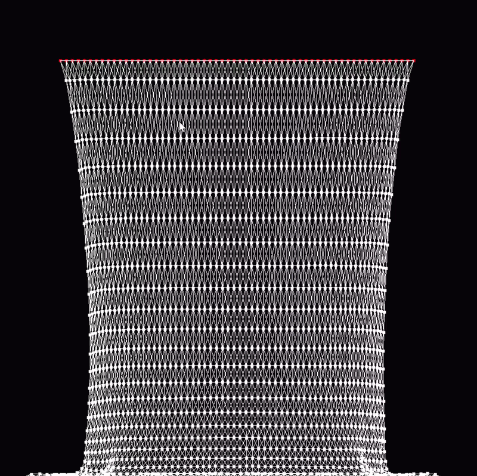

# Cloth Simulation Tool

A real-time **cloth simulation tool** built using **Verlet Integration** in C++ with **SDL2 rendering**.
This project explores physics-based simulation of cloth using a network of nodes and constraints.

The goal of this project is to understand and implement **physics simulation techniques used in game engines**, especially **Verlet integration, constraint solving, and cloth systems**.



---

## Features

* Verlet Integration based physics
* Real-time cloth simulation
* Node–constraint system (threads)
* Structural + shear constraints
* Pinned nodes support
* Boundary collision handling
* Configurable physics parameters (gravity, drag, elasticity)
* SDL2 rendering

---

## Simulation Overview

The cloth is represented as a **grid of nodes** connected by **distance constraints (threads)**.

Each simulation step performs:

1. **Verlet Integration**

   * Update node positions using previous positions and acceleration.

2. **Constraint Solving**

   * Maintain rest lengths between connected nodes.

3. **Collision Handling**

   * Keep nodes inside the simulation bounds.

This loop creates realistic cloth motion.

---

## Verlet Integration

The core physics equation used:

```
newPosition = currentPosition 
            + (currentPosition - previousPosition) * (1 - drag) 
            + acceleration * dt²
```

Advantages of Verlet Integration:

* Stable for constraint systems
* No explicit velocity storage required
* Widely used in cloth and rope simulations

---

## Technologies Used

* **C++17**
* **SDL2**

---

## Future Improvements

Planned features:

* Mouse interaction (drag cloth / cut constraints)
* Wind forces
* Bending constraints
* GPU acceleration
* SIMD optimization (SSE / AVX)
* Larger cloth grids, ropes, shape presets, particle simulation etc

---
